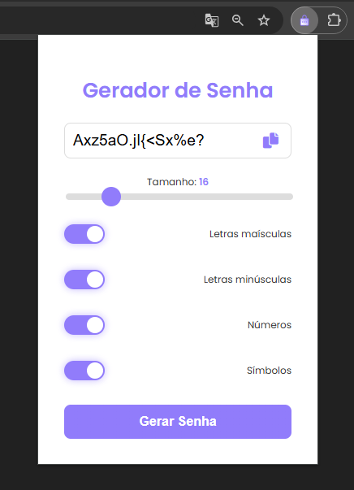

# Gerador de senhas [Extensão]

Uma extensão de navegador para gerar senhas customizáveis de forma rápida e segura. Permite ao usuário definir características da senha gerada, como tamanho e inclusão de letras maiúsculas, minúsculas, números e símbolos, com um design intuitivo e fácil de usar.

## Funcionalidades

- **Personalização Completa**: Configure o tamanho da senha e personalize com letras maiúsculas, minúsculas, números e símbolos.
- **Interface Intuitiva**: Design simples, criado para facilitar a criação de senhas seguras.
- **Segurança**: Senhas geradas com variadas combinações de caracteres para maior segurança.

## Instalação

1. Baixe o repositório ou a extensão no formato `.zip`.
2. No navegador Chrome, vá para `chrome://extensions/`.
3. Ative o **Modo de desenvolvedor** no canto superior direito.
4. Clique em **Carregar sem compactação** e selecione a pasta do projeto.
5. A extensão estará pronta para uso.

## Como Usar

1. Clique no ícone da extensão no navegador.
2. Personalize a senha usando as opções fornecidas.
3. Clique em **Gerar Senha** e copie a senha gerada.

## Exemplo de Uso

## Tecnologias Utilizadas

- **HTML, CSS, JavaScript** para a interface e lógica de geração de senha.

## Contribuição

Contribuições são bem-vindas! Para reportar bugs ou sugerir melhorias, abra uma *issue*.

---

Desenvolvido por Vinícius Henrique Sponchiado.
